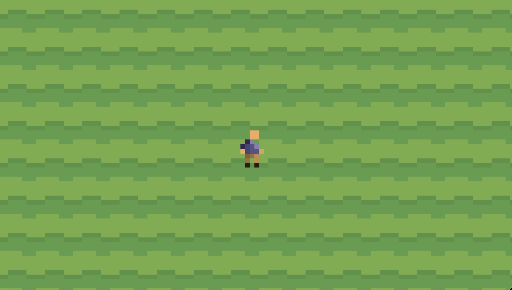

# Drifting Forest Server
WIP roguelike mmo



## Compiling
DF depends on [uWebSockets](https://github.com/uNetworking/uWebSockets)

I might switch to CMake if this gets more complex, but just run make for now to get an executable.

1. clone this repo and move into it
```
git clone https://github.com/CoherentNonsense/drifting-forest-server.git && cd drifting-forest-server
```
2. compile with make and run the executable
```
make && ./a.out
```

## Documentation

[This is mostly for myself rn](docs/README.md)