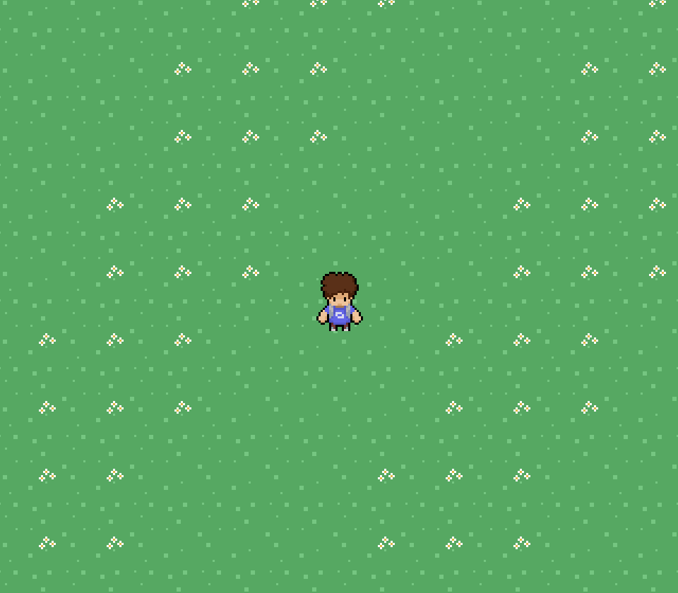

# Drifting Forest (??? Pending Title)

WIP casual mmo 

Note: Sort of pivoted from the roguelike thing



## Compiling
DF depends on [uWebSockets](https://github.com/uNetworking/uWebSockets)

1. clone this repo and move into it
```
git clone https://github.com/CoherentNonsense/drifting-forest-server.git && cd drifting-forest-server/server
```
2. compile with make and run the executable
```
make && ./server
```

## Documentation

[This is mostly for myself rn](docs/README.md)